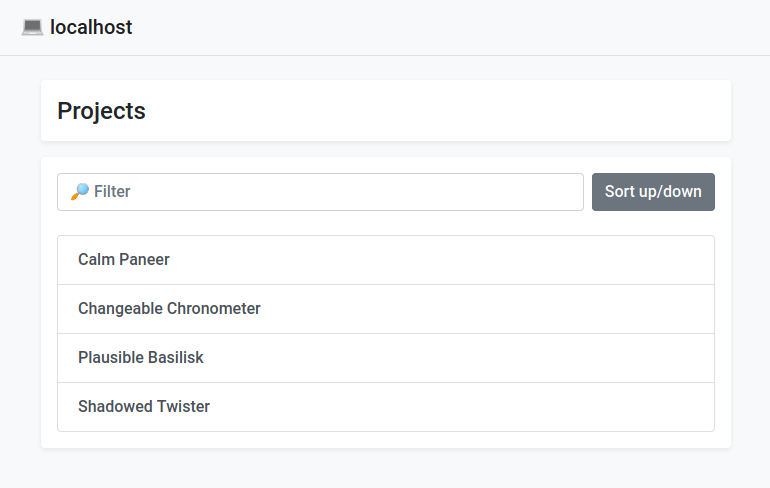

# Localhost Project Listing

Static template package to build a nicely readable list of all projects
on a local development machine.

_⭐ You like this package? Please star it or send a tweet. ⭐_

## Vison

- HTML app, no server side scripts
- No automatic detection of ports/projects
  - Active decision which projects to show
- KISS

## Requirements

- None

## Installation

- Clone the repository or use a package manager to install the project
- Point the local webserver to `web` directory

## Source

https://gitlab.com/pixelbrackets/localhost-project-listing/

Mirror https://github.com/pixelbrackets/localhost-project-listing/ (Issues &
Pull Requests mirrored to GitLab)

## Demo

🚀 https://pixelbrackets.gitlab.io/localhost-project-listing/

## Usage

- Edit the `web/index.html` and change the project list as desired

## License

GNU General Public License version 2 or later

The GNU General Public License can be found at http://www.gnu.org/copyleft/gpl.html.

## Author

Dan Untenzu (<mail@pixelbrackets.de> / [@pixelbrackets](https://pixelbrackets.de))

## Changelog

See [CHANGELOG.md](./CHANGELOG.md)

## Contribution

This script is Open Source, so please use, share, patch, extend or fork it.

[Contributions](./CONTRIBUTING.md) are welcome!

## Feedback

Please send some [feedback](https://pixelbrackets.de/) and share how this
package has proven useful to you or how you may help to improve it.
